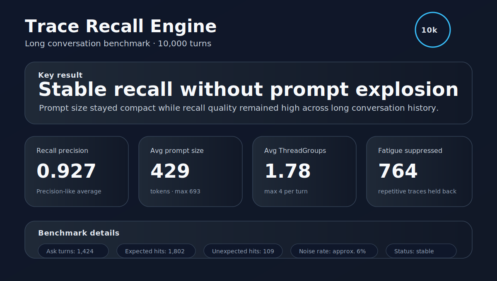

# Trace Recall Engine

> An experimental trace-based conversational memory architecture.

> **Status:** Research Prototype (Active Development)

---

## Benchmark Snapshot



The 10,000-turn benchmark suggests that the recall pipeline remains stable at long conversation scale:

- Recall Precision: 0.927
- Avg Prompt Size: 429 tokens
- Avg ThreadGroups: 1.78
- Fatigue Suppressed: 764

See the [benchmark history and evaluation conditions](docs/benchmarks/README.md) for the benchmark sequence, scope, and limitations.

## Start Here

- [Getting Started](docs/getting_started.md)
- [Architecture](docs/architecture/trace_recall_architecture.md)
- [Benchmark History](docs/benchmarks/README.md)
- [Documentation Index](docs/README.md)
- [Current Research Direction](docs/research/current_research_direction.md)
- [Extractor Research Plan](docs/research/extractor_research_plan.md)

## Requirements

- Python 3.10 or later
- No third-party dependencies

The current research prototype intentionally relies only on Python's standard library to keep experiments simple and reproducible.

---

## Why?

This project did not begin with a new algorithm.

It began with a feeling.

While developing **AIKanojyo**, we repeatedly encountered the same problem.

The AI could remember facts.

It could retrieve previous conversations.

It could answer correctly.

Yet something still felt wrong.

It did not feel like the AI was remembering.

It felt like the AI was searching.

That simple observation became the starting point of this project.

---

## The Question

Most conversational memory systems retrieve previously stored text.

```
Conversation
        │
        ▼
 Embedding
        │
        ▼
 Vector Search
        │
        ▼
 Retrieved Chunks
        │
        ▼
      LLM
```

This works remarkably well for factual retrieval.

But conversations are different.

Human conversations rarely return as complete sentences.

Instead, small fragments appear.

A word.

A place.

A familiar topic.

Those fragments gradually reconnect until the experience becomes meaningful again.

This project asks a simple question:

> **Can conversational memory emerge from traces rather than retrieved text?**

---

## Core Idea

Instead of storing conversations as documents, this project stores **traces**.

A trace is intentionally small.

It is not a sentence.

It is not a summary.

It is not knowledge.

It is simply evidence that an experience once happened.

When new input arrives,

those traces become activated,

a small subset is selected,

Working Memory is built,

and only then does the LLM construct meaning.

Meaning is never stored.

Meaning emerges.

---

## Architecture

```text
Conversation
      │
      ▼
Trace Extraction
      │
      ▼
Trace Memory
├── Word Nodes
├── Experience Threads
├── Thread Groups
└── Connection History
      │
      ▼
Raw Activation
      │
      ▼
Recall Selection
      │
      ▼
Working Memory
      │
      ▼
LLM
      │
      ▼
Response
```

Each layer has exactly one responsibility.

---

## Design Principles

### The application does not construct meaning.

The application stores traces.

The application activates traces.

The application selects traces.

The LLM constructs meaning.

This separation of responsibilities is the central design principle of the project.

---

### Store traces, not memories.

A stored sentence already contains interpretation.

A trace does not.

The application intentionally avoids generating summaries, semantic labels, or rewritten memories before the LLM.

---

### Remembering is not speaking.

A trace may be successfully recalled.

That does not mean it belongs in the current conversation.

This distinction led to the introduction of:

- Recall Selection
- Working Memory
- Topic Fatigue

---

## Current Features

### Memory

- Trace Extraction
- Experience Threads
- Thread Groups
- Count-based Trace Reinforcement

### Recall

- Raw Activation
- Activation Gate
- Recall Selection
- Working Memory Construction

### Conversation

- Topic Fatigue
- Explainable Recall
- Prompt Optimization

### Evaluation

- Fixed JSONL evaluation scenarios
- Explainable logs
- Long conversation benchmarks
- Recall Precision metrics

### Research Infrastructure

- Participant Reference Normalization for user/assistant pronouns
- Speaker Origin metadata through `created_by`
- Prompt Views: `threadgroup`, `recall-state`, and `edge`
- Parameter sensitivity sweeps, including categorical experiment dimensions
- Feature ablation for Participant Reference and Origin Order
- Reproducibility manifests for sensitivity runs
- Prompt-response Research Logger outputs for evaluation and sensitivity experiments

---

## Evaluation

The repository includes an evaluation framework.

Example:

```bash
python src/threaded_concept_memory_probe.py eval \
  --conversation-file eval_conversations/seed_tests_public.jsonl \
  --db reports/seed_tests.db \
  --no-response \
  --events-jsonl reports/seed_tests_events.jsonl \
  --metrics-csv reports/seed_tests_metrics.csv \
  --report-md reports/seed_tests.md
```

Current evaluation focuses on:

- Recall Precision
- Unexpected Recall
- Prompt Size
- Working Memory Size
- Recall Efficiency
- Topic Fatigue

The current goal is **not** improving storage.

The current goal is improving:

- Recall Selection
- Working Memory quality
- Conversation quality
- Long-term conversational recall

## Current Research Direction

The recall pipeline has been evaluated from short scenarios through 10,000-turn stress tests.

The next major research question is the extraction boundary. The current prototype uses an LLM Extractor when an endpoint is configured. This is useful as a research Baseline, but it introduces latency, non-determinism, API dependency, and an additional model dependency. Without an endpoint, the current implementation uses an implemented fallback extraction path for diagnostics and basic operation.

The next phase will compare:

- the current LLM Extractor
- the existing fallback Extractor
- a planned deterministic Trace-specific local Extractor
- morphological-analysis-assisted approaches, if necessary

The goal is not to reproduce the LLM Extractor word-for-word. The goal is to determine whether local extraction can preserve downstream recall quality well enough for future AIKanojyo integration.

See [Current Research Direction](docs/research/current_research_direction.md) and the [Extractor Research Plan](docs/research/extractor_research_plan.md).

---

## Repository Layout

```text
.
├── README.md
├── LICENSE
├── src/
│   └── threaded_concept_memory_probe.py
├── docs/
├── eval_conversations/
└── reports/        # ignored local output
```

- **src/** contains the research prototype.
- **docs/** contains architecture and design documents.
- **eval_conversations/** contains reproducible evaluation scenarios.
- **reports/** stores local benchmark results and is intentionally excluded from version control.

---

## Documentation

The repository is accompanied by design documents describing the evolution of the architecture.

Topics include:

- Why Trace?
- Trace Principle
- Architecture
- Activation
- Recall Selection
- Working Memory
- Topic Fatigue
- Evaluation
- Design History
- Future Research

The documentation explains **why** the architecture looks the way it does, not only **how** it works.

---

## Origin

This project originally began as an experimental memory subsystem for **AIKanojyo**.

Over time, the research expanded beyond the original application and became an independent exploration of conversational recall.

Although the implementation may eventually be reused elsewhere, this repository focuses on the memory architecture itself.

---

## AI-assisted Development

This project is developed with extensive assistance from AI tools including ChatGPT and Codex.

Architecture, experiments, evaluation methodology, and design decisions are guided by the project maintainer through iterative discussion and benchmarking.

AI-generated code is treated as a starting point rather than a final result.

---

## Current Status

Research Prototype

Many ideas presented here remain experimental.

The purpose of this repository is not to present a finished solution, but to document an evolving line of research.

Feedback, criticism, alternative ideas, benchmark scenarios, and related research are all welcome.

---

## Language Support

The current research prototype is optimized for Japanese conversations.

The underlying architecture is intended to be language-independent, but the current trace extraction and evaluation datasets are implemented for Japanese.

Language-independent trace extraction remains future work.

---

## License

MIT License

---

## Why Continue?

This repository is not an attempt to reproduce the human brain.

It asks a much smaller question.

> **How little must an AI remember for meaningful conversational recall to emerge?**

Perhaps this architecture is wrong.

Perhaps traces are not the answer.

That is perfectly acceptable.

If this project encourages someone to ask better questions about conversational memory,

then it has already achieved one of its goals.

---

## About this project

Trace Recall Engine began as an attempt to improve the memory system of an AI companion project called AIKanojyo.

Along the way, the research gradually shifted.

The central question was no longer:

"How should conversations be stored?"

Instead, it became:

"How should past experiences become part of a new conversation?"

This repository documents that ongoing exploration.

## Local Rule Extractor v0 Status

LLM Extractor is the current baseline; fallback remains a diagnostic path. Local Rule Extractor v0 is now an experimental deterministic local candidate: it uses no morphological analyzer, no external API, and is not integrated with Android yet.

## Oracle Replay Evaluator

Oracle Replay is an offline evaluator, not a production selector. It replays saved extractor Oracle details JSONL to compare fixed virtual selection strategies before implementation.

It does not alter Trace storage, Recall, or current extractor behavior. It does not change candidate generation, tokenization, gates, activation, working memory, or local-rule selection.

Its purpose is to estimate selector trade-offs before implementing them: expected-hit gain, word-count growth, unmatched added words, and counterexample risk. AIKanojyo integration remains the practical end goal; the next step after a useful replay result is to implement only the smallest promising extractor strategy and verify it downstream.

Dictionary coverage diagnostics keep DB vocabulary coverage separate from built-in protected patterns, mixed-script spans, dates, URLs, email, and other protected-span sources. If DB-derived protected matches are zero, DB dictionary coverage of zero is correct rather than a replay-adjusted score.

### Candidate Span Generator v2

Candidate Span Generator v2 adds only structurally grounded Mixed Script and safe terminal-boundary candidates. New candidates remain diagnostic-only and are not promoted to production extraction output. Oracle Replay is reused to test generalization before any selector change.

The generator records candidate `source` and `reason` metadata for oracle diagnostics while keeping final words, trace persistence, and recall behavior unchanged.

## Mixed Script Promotion Experiment

Mixed Script promotion is experimental and disabled by default. Enable it only for A/B runs with `--enable-mixed-script-promotion` together with the `local-rule` extractor.

Only structurally generated `mixed-script` candidates may be promoted. Terminal-boundary and general alternate candidates remain diagnostic-only, and baseline reconciliation between extractor evaluation and oracle replay is required before interpreting A/B gains.
