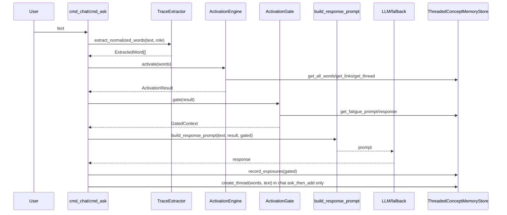

> 調査範囲: このリポジトリに存在する Trace Recall Engine のコードと同梱ドキュメントから確認した内容のみを記載する。AIKanojyo 本体の `ChatOrchestrator`、`MemoryRetrievalMerge`、`PromptInputModel`、`StructuredPromptBuilder` 等の実装コードはこのリポジトリでは未確認。未確認箇所は推測せず「未確認」とする。

# CHAT_PIPELINE

## 会話処理フロー

このリポジトリで確認できる会話処理は CLI の `cmd_chat` / `cmd_ask` / `cmd_prompt_preview` である。AIKanojyo 本体の Intent 判定、WorkingMemory、Emotion、Relationship の実装は未確認。

## ステップと担当メソッド

| フェーズ | 担当メソッド / 関数 | 現在の実装 |
|---|---|---|
| ユーザー入力 | `cmd_chat`, `cmd_ask`, `cmd_prompt_preview` | CLI 引数または interactive input。 |
| Intent | 未確認 | `/add`, `/ask`, default ask_then_add の CLI 分岐はあるが、AIKanojyo の Intent 実装は未確認。 |
| WorkingMemory | `ActivationGate.gate` → `GatedContext` | Trace 用の prompt 候補。AIKanojyo WorkingMemory 本体は未確認。 |
| Memory Retrieval | `ActivationEngine.activate` | 保存済み words/threads/link を探索。既存 MemoryRetrieval 実装は未確認。 |
| RecallFact | 未確認 | 本リポジトリに RecallFact 実装なし。 |
| Emotion | 未確認 | 実装未確認。 |
| Relationship | exposure/fatigue 以外は未確認 | Relationship model 本体は未確認。 |
| Prompt | `build_response_prompt`, `format_gated_recall_context` | current input、extracted words、gated context、activation trace 表示方針、instruction を生成。 |
| LLM | `ResponseGenerator.generate`, `call_openai_compatible_chat`, `fallback_generate_response` | OpenAI compatible endpoint があれば使用、失敗時 fallback。 |
| Response | `ResponseGenerator.generate` | 文字列応答。 |
| Memory Commit | `ThreadedConceptMemoryStore.create_thread` | `cmd_chat` の default/add path、`cmd_add`、seed/bootstrap で保存。`cmd_ask` は入力を保存しない。 |
