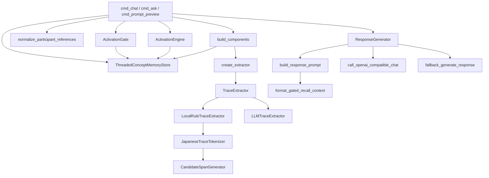

> 調査範囲: このリポジトリに存在する Trace Recall Engine のコードと同梱ドキュメントから確認した内容のみを記載する。AIKanojyo 本体の `ChatOrchestrator`、`MemoryRetrievalMerge`、`PromptInputModel`、`StructuredPromptBuilder` 等の実装コードはこのリポジトリでは未確認。未確認箇所は推測せず「未確認」とする。

# DEPENDENCY_MAP

## 確認できる依存図

`ChatOrchestrator` はこのリポジトリでは未確認。代替として、確認できる CLI orchestrator (`cmd_chat` / `cmd_ask`) からの依存を示す。

## ChatOrchestrator からの依存

未確認。
