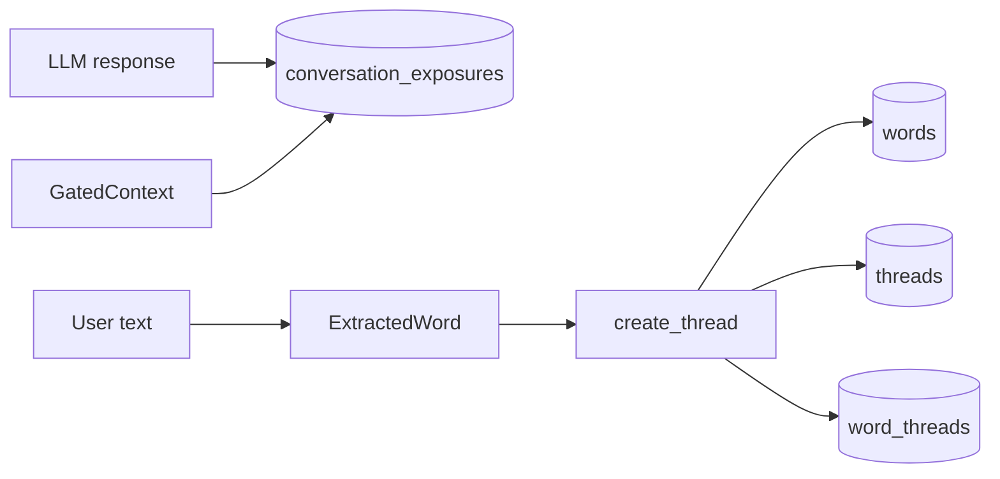

> 調査範囲: このリポジトリに存在する Trace Recall Engine のコードと同梱ドキュメントから確認した内容のみを記載する。AIKanojyo 本体の `ChatOrchestrator`、`MemoryRetrievalMerge`、`PromptInputModel`、`StructuredPromptBuilder` 等の実装コードはこのリポジトリでは未確認。未確認箇所は推測せず「未確認」とする。

# MEMORY_COMMIT_FLOW

## LLM 応答後に保存されるもの

## 現在の実装

| 保存対象 | 保存先 | 実装 |
|---|---|---|
| 入力由来の Trace thread | `threads` | `create_thread(words, source_text, created_by)` |
| 抽出語 | `words` | `_upsert_word_node` |
| word-thread relation | `word_threads` | `create_thread` 内で insert/replace |
| Prompt/response exposure | `conversation_exposures` | `record_exposures` |
| Activated word reinforcement | `words.strength` 等 | `reinforce_seen` |
| LLM 応答本文そのもの | 未確認 | `conversation_exposures` には response exposure の word/thread/canonical_key は保存されるが、本文保存は未確認。 |
| MemoryCandidate | 未確認 | 実装なし。 |
| LongTermMemory | AIKanojyo 本体は未確認 | Trace DB は長期的保存として機能。 |
| Embedding | 未確認 | 実装なし。 |
| Relationship | 未確認 | 実装なし。 |

`cmd_chat` の default は ask 後に `create_thread` でユーザー入力を保存する。`cmd_ask` は retrieval/response/exposure を行うが、入力を新規 thread として保存しない。
