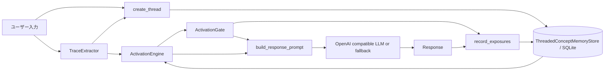

> 調査範囲: このリポジトリに存在する Trace Recall Engine のコードと同梱ドキュメントから確認した内容のみを記載する。AIKanojyo 本体の `ChatOrchestrator`、`MemoryRetrievalMerge`、`PromptInputModel`、`StructuredPromptBuilder` 等の実装コードはこのリポジトリでは未確認。未確認箇所は推測せず「未確認」とする。

# SYSTEM_OVERVIEW

## 確認できたシステム全体構成

このリポジトリで実装されている中心は、会話テキストから Trace 用語を抽出し、SQLite に `words` / `threads` / `word_threads` として保存し、入力語から連想的に活性化し、Gate で Prompt 候補へ絞り込む Trace Recall Engine である。

AIKanojyo 本体側の全体構成は未確認。

## 各モジュールの役割

| モジュール | 役割 | 確認状況 |
|---|---|---|
| `TraceExtractor` | `extract(text)` で `ExtractedWord` を返す抽出境界。 | 確認済み |
| `LocalRuleTraceExtractor` | 決定論的 Trace 候補抽出。保護 span、tokenizer、候補生成、dedupe、diagnostics を担当。 | 確認済み |
| `JapaneseTraceTokenizer` | 文章・句・文字種境界ベースで primary chunk を生成し、alternate は diagnostics として保持。 | 確認済み |
| `CandidateSpanGenerator` | mixed-script / terminal-boundary の診断候補を生成。 | 確認済み |
| `ThreadedConceptMemoryStore` | SQLite schema、Trace thread 作成、word/thread/link 取得、exposure 記録、reinforce を担当。 | 確認済み |
| `ActivationEngine` | 入力語から word/thread graph を BFS 的に伝播し `ActivationResult` を作る。 | 確認済み |
| `ActivationGate` | prompt-visible な ThreadGroup / Word を選別し `GatedContext` を作る。 | 確認済み |
| `ResponseGenerator` | Prompt を組み立て、OpenAI compatible Chat API または fallback で応答生成。 | 確認済み |
| `ChatOrchestrator` | AIKanojyo 本体会話制御。 | 未確認 |
| `MemoryRetrievalMerge` | 既存 Memory Retrieval の merge。 | 未確認 |
| `RecallFact` 系 | 本リポジトリには実装なし。 | 未確認 |

## データの流れ

1. 入力テキストを `extract_normalized_words` が extractor に渡し、必要に応じて participant reference 正規化を行う。
2. `/ask` と chat の ask path では `ActivationEngine.activate` が保存済み Trace DB を参照して `ActivationResult` を作る。
3. Gate 有効時は `ActivationGate.gate` が `GatedContext` を作る。
4. `build_response_prompt` が current input、extracted words、activated/gated recall context、instruction を Prompt に組み立てる。
5. `ResponseGenerator.generate` が LLM に投げる。失敗時または LLM 未設定時は fallback 応答。
6. chat の default path では応答後に入力テキストが `create_thread` で保存される。`cmd_ask` は保存しない。
7. Gate がある場合、prompt exposure と response exposure が `conversation_exposures` に保存される。

## モジュール間依存

`build_components` が Store、Extractor、ActivationEngine、ResponseGenerator を生成し、extractor が `set_trace_vocabulary_provider` を持つ場合は Store を注入する。Activation は Store に依存し、Gate は fatigue 参照のため任意で Store に依存する。
