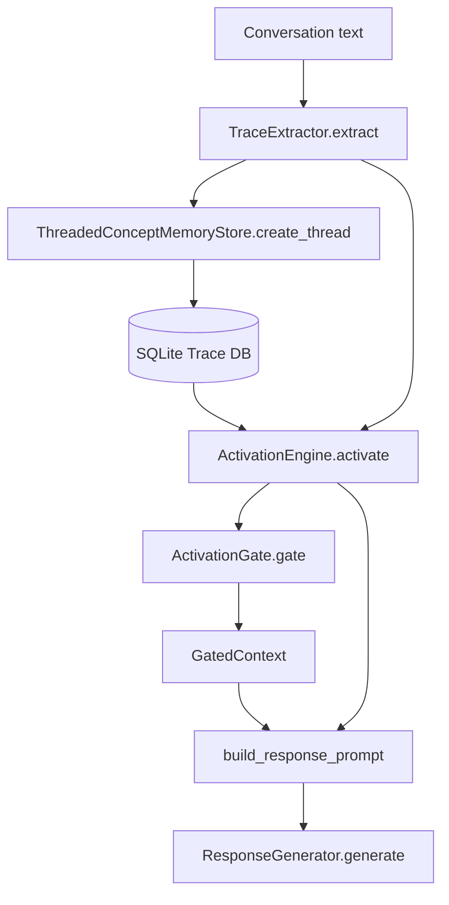

> 調査範囲: このリポジトリに存在する Trace Recall Engine のコードと同梱ドキュメントから確認した内容のみを記載する。AIKanojyo 本体の `ChatOrchestrator`、`MemoryRetrievalMerge`、`PromptInputModel`、`StructuredPromptBuilder` 等の実装コードはこのリポジトリでは未確認。未確認箇所は推測せず「未確認」とする。

# TRACE_RECALL_ARCHITECTURE

## 用語対応

| 指示書上の名称 | このリポジトリで確認できる対応物 | 状態 |
|---|---|---|
| TraceNode | `WordNode` | 名前は異なるが word node は存在。 |
| TraceConnection | `WordThreadLink` | word と thread の link。 |
| ExperienceThread | `Thread` / `GatedThreadGroup` | 保存単位は `Thread`、Prompt 圧縮単位は `GatedThreadGroup`。 |
| TraceActivation | `ActivationTrace`, `ActivatedWord`, `ActivatedThread`, `ActivationResult` | activation 結果と伝播ログ。 |
| TraceRecallCandidateProvider | `ActivationGate.gate` / prompt formatter | 専用 class 名は未確認。 |
| RecallFactScorer | 未確認 | 実装なし。 |
| RecallRegenerationHint | 未確認 | 実装なし。 |

## Trace → Prompt → LLM

## RecallFact との接続

本リポジトリでは `RecallFact`、`RecallFactScorer`、`RecallRegenerationHint` の実装は確認できない。したがって「Trace → RecallFact → Prompt → LLM」は未確認である。

## MemoryRetrievalMerge との接続

`MemoryRetrievalMerge` 実装はこのリポジトリでは確認できない。Trace Engine が `MemoryRetrievalMerge` に接続されている証拠もないため、現時点では未接続として扱う。
